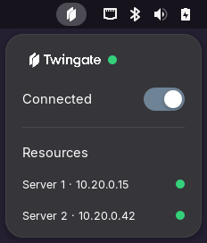

<div align="center">


# Twingate Panel

**Control the Twingate VPN client from the GNOME top panel — no terminal required.**


[Repository](https://github.com/urhend/twingate-panel)

*Not affiliated with or endorsed by Twingate Inc. "Twingate" and its logo are trademarks of their respective owner, used here for identification purposes only.*

</div>

---

## Table of contents

- [Overview](#overview)
- [Screenshot](#screenshot)
- [Features](#features)
- [How it works](#how-it-works)
- [Requirements](#requirements)
- [Installation](#installation)
- [Configuration](#configuration)
- [Testing on Wayland](#testing-on-wayland)
- [Project layout](#project-layout)
- [Known limitations](#known-limitations)
- [License](#license)
- [Disclaimer](#disclaimer)

## Overview

**Twingate Panel** is a lightweight GNOME Shell extension that puts the
[Twingate](https://www.twingate.com/) zero-trust VPN client one click away.
Instead of remembering `twingate start`, `twingate stop`, `twingate status`,
and `twingate resources`, you get a single indicator in the top bar with a
dropdown menu that does it all.

## Screenshot

<div align="center">

</div>

## Features

| | |
|---|---|
| 🟢 **Live status dot** | Grey (disconnected), yellow (connecting), green (connected) — always visible in the dropdown header. |
| 🔌 **One-click connect / disconnect** | A toggle switch drives `twingate start` / `twingate stop` for you. |
| 📡 **Resource list with reachability** | Every authorized resource is listed as `name · address`, each with its own dot that turns green or red based on a live ping. |
| 🖼️ **Static, theme-independent icon** | The panel icon doesn't change color or shift with light/dark shell themes — it's always your Twingate mark. |
| ⚙️ **In-menu preferences** | A settings icon in the dropdown header opens a native GTK4/libadwaita preferences window — no more editing source files. |
| ⚡ **Fully asynchronous** | Every external command (`twingate`, `pkexec`, `ping`) runs via non-blocking `Gio.Subprocess` — the shell never freezes while it works. |
| 🧹 **Clean lifecycle** | Timers, subprocesses, and menu state are fully torn down on disable — no leaks, no zombie polling. |

## How it works

```
┌─ Top panel ─────────────────────────────┐
│  [Twingate icon]                        │
└──────────────┬───────────────────────────┘
               │ click → dropdown:
               │   [Twingate wordmark]  ● status dot   ⚙ (opens Preferences)
               │   ────────────────────────
               │   Connected  [ toggle ]
               │   ────────────────────────
               │   Resources
               │     server-a · 192.168.0.10        ●
               │     server-b · 192.168.0.20        ●
               ▼
      Poll loop (every 5s while enabled)
               │
               ▼
   twingate -d status   →  updates status dot
   twingate -d resources →  updates resource list (only while connected)
   ping -c 1 -W 1 <ip>   →  updates each resource's reachability dot
```

Toggling the switch runs `pkexec twingate start` or `pkexec twingate stop`,
which shows GNOME's native graphical polkit prompt for your password — the
extension itself never sees or handles your credentials.

## Requirements

- GNOME Shell 50 (Wayland or X11)
- The Twingate Linux client installed, with the CLI available at
  `/usr/bin/twingate` — see the
  [official Twingate Linux installation guide](https://www.twingate.com/docs/linux)
  for setup instructions on your distribution
- `pkexec` (polkit) and `ping` (iputils) available on `PATH` — present on
  virtually every desktop Linux distribution by default

Twingate itself must already be set up once, from a terminal:

```bash
sudo twingate setup   # one-time network/account configuration
twingate start        # first login — opens a browser to authenticate
```

After that, the daemon's tokens are stored globally (`/var/lib/twingate`),
and the extension handles day-to-day connect/disconnect.

## Installation

### From source

```bash
git clone https://github.com/urhend/twingate-panel.git
ln -s "$(pwd)/twingate-panel" ~/.local/share/gnome-shell/extensions/twingate-panel@urhend
gnome-extensions enable twingate-panel@urhend
```

Then log out and back in (or reload GNOME Shell on X11 with <kbd>Alt</kbd>+<kbd>F2</kbd>, `r`) so the Shell picks up the new extension.

## Configuration

Click the ⚙ icon in the top-right of the dropdown (opposite the Twingate
logo) to open the preferences window — or run:

```bash
gnome-extensions prefs twingate-panel@urhend
```

| Setting | Default | Description |
|---|---|---|
| Poll interval | `5` seconds | How often status and resources are refreshed. Takes effect immediately, no reload needed. |
| Use pkexec | `on` | Show a graphical polkit password prompt for connect/disconnect. Turn off only if you've configured a scoped `NOPASSWD` sudoers rule for the exact `start`/`stop` commands. |
| Twingate binary path | `/usr/bin/twingate` | Path to the Twingate CLI binary. |

Settings are stored via GSettings (schema
`org.gnome.shell.extensions.twingate-panel`), so they persist across
extension reloads and updates.

## Testing on Wayland

Wayland doesn't support reloading GNOME Shell in place, so use a nested
session instead of logging out while iterating:

```bash
env MUTTER_DEBUG_DUMMY_MODE_SPECS=1400x900 dbus-run-session -- gnome-shell --wayland
```

Watch for errors in another terminal:

```bash
journalctl -f -o cat /usr/bin/gnome-shell
```

## Project layout

```
twingate-panel/
├── metadata.json            # Extension manifest (uuid, name, shell-version…)
├── extension.js             # All logic: indicator, menu, polling, subprocesses
├── prefs.js                 # GTK4/libadwaita preferences window
├── stylesheet.css           # Panel/menu styling (status dots, fonts, spacing)
├── schemas/
│   ├── org.gnome.shell.extensions.twingate-panel.gschema.xml
│   └── gschemas.compiled    # Compiled schema (required at runtime)
├── icons/
│   ├── twingate-panel.png   # Static top-bar icon
│   └── twingate-wordmark.png# Logo shown in the dropdown header
├── screenshots/
│   └── menu.png             # Dropdown menu preview (used in this README)
├── LICENSE                  # GPL-3.0-or-later
└── README.md
```

## Known limitations

- `start`/`stop` always prompt for a password via `pkexec` unless you set up
  a passwordless `sudoers` rule yourself (see [Configuration](#configuration)).
- Resource reachability is a simple one-shot ICMP ping; it doesn't reflect
  Twingate's own internal routing/health checks.

## License

Licensed under the [GNU General Public License v3.0 or later](LICENSE)
(GPL-3.0-or-later) — see the [`LICENSE`](LICENSE) file for the full text.

## Disclaimer

This is an unofficial, community-built project. It is **not affiliated
with, endorsed by, or supported by Twingate Inc.** The Twingate name and
logo belong to their respective owner and are used here only to identify
the software this extension controls.
